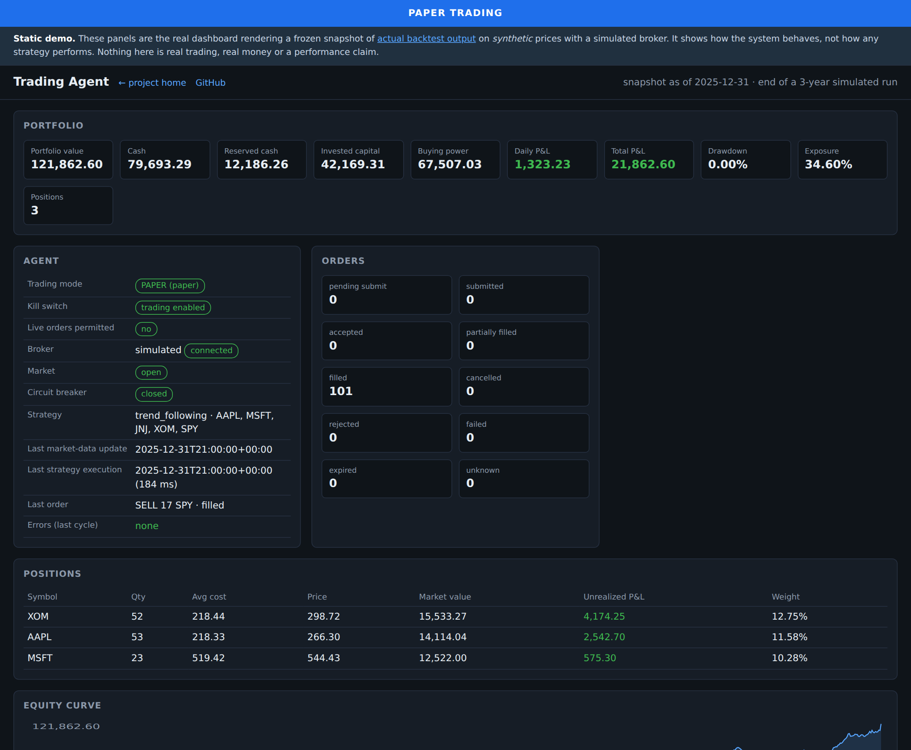

<h1 align="center">Claude&nbsp;Projects</h1>

<p align="center">
  Production-grade projects built with Claude Code — complete, tested and documented,<br>
  not prototypes that stop at the happy path.
</p>

<p align="center">
  <a href="https://mohammadrezababaee-lab.github.io/Claude-Projects/"></a>
  <a href="#-trading-agent"></a>
  <a href="LICENSE"></a>
</p>

---

## 📈 Trading Agent

**An automated algorithmic trading agent that defaults to not trading.**

A complete backtesting engine, a realistic paper-trading broker, and a real brokerage adapter that
stays switched off until a deliberate six-part safety gate is opened. Every decision it makes —
including the ones where it does nothing — is recorded with the reasoning behind it.

<p align="center">
  <a href="https://mohammadrezababaee-lab.github.io/Claude-Projects/demo/">
    
  </a>
</p>

<p align="center">
  <b><a href="https://mohammadrezababaee-lab.github.io/Claude-Projects/demo/">▶ Open the interactive dashboard demo</a></b> &nbsp;·&nbsp;
  <a href="https://mohammadrezababaee-lab.github.io/Claude-Projects/">Project site</a> &nbsp;·&nbsp;
  <a href="trading-agent/">Source</a> &nbsp;·&nbsp;
  <a href="trading-agent/docs/Trading-Agent-How-To-Guide.docx">How-To guide (38 pp)</a>
</p>

### What makes it different

| | |
|---|---|
| **Risk can veto the strategy** | 23 independent checks run after every signal. Any failure blocks the order, and the strategy cannot override it. |
| **No duplicate trades, ever** | An idempotency key is written to the database *before* the broker is called. A lost response triggers a lookup, never a resend. |
| **Every decision is explainable** | Buys, sells, holds and vetoes store the signal, indicators, portfolio state, each risk check and the sizing arithmetic in plain language. |
| **Backtests that don't flatter you** | Signals compute at the close and fill at the next open, so look-ahead is impossible by construction — and a test proves it. |
| **Failure is a first-class case** | Outages, stale quotes, malformed prices, partial fills, unknown outcomes and mid-flight restarts each have defined behaviour and a test. |
| **Not tied to one broker** | Strategies never import the broker layer; a test enforces it. Simulated and Alpaca adapters ship today. |

### Safety posture

```ini
TRADING_MODE=paper              # live requires five settings to agree
TRADING_ENABLED=false           # kill switch, engaged by default
LIVE_TRADING_CONFIRMED=false    # plus an exact confirmation phrase
                                # plus --i-understand-live-trading on the command line
```

Leaving a live confirmation set while in paper mode is a **startup error**, so no single-variable
change can flip the system into live trading. Every risk limit, the kill switch and the circuit
breaker apply unchanged in live mode.

### At a glance

| | |
|---|---|
| Language | Python 3.11+ |
| Tests | 116 (unit, integration, failure modes) |
| Risk checks | 23 per proposed order |
| Storage | SQLite for development, PostgreSQL for production |
| Brokers | Simulated · Alpaca · *(Avanza refuses to start — no official API)* |
| Markets | Ordinary equities and ETFs. No margin, shorting, derivatives or leveraged products |
| Docs | Architecture, broker integration, risk, security, backtesting, live trading, plus a 38-page Word guide |

---

## Repository layout

```
Claude-Projects/
├── index.html              # project site (GitHub Pages)
├── demo/                   # static dashboard demo
│   ├── index.html          #   the real dashboard, reading a frozen snapshot
│   ├── build_demo_data.py  #   regenerates that snapshot from the actual engine
│   └── data/               #   the snapshot itself
└── trading-agent/          # the project
    ├── trading_agent/      #   application package
    ├── tests/              #   unit · integration · failure
    ├── migrations/         #   alembic
    ├── docs/               #   architecture, risk, security, live trading, how-to
    └── scripts/            #   backtest and paper-trading examples
```

The demo is not a mockup: it is the production dashboard rendering output that
`demo/build_demo_data.py` produced by actually running the backtesting engine. Regenerate it with:

```bash
cd trading-agent && pip install -e "."
cd .. && python demo/build_demo_data.py
```

## Getting started

```bash
git clone https://github.com/MohammadRezaBabaee-Lab/Claude-Projects.git
cd Claude-Projects/trading-agent
python -m venv .venv && source .venv/bin/activate
pip install -e ".[dev]"
cp .env.example .env
trading-agent validate-config

# Stage 1 — backtest on deterministic synthetic prices, no account needed
trading-agent backtest --synthetic --symbols AAA,BBB,CCC --start 2022-01-03 --end 2024-12-31

# Stage 2 — one paper-trading cycle, then the dashboard
MARKET_DATA_PROVIDER=synthetic TRADING_ENABLED=true trading-agent run --once
trading-agent dashboard
```

Full instructions are in [`trading-agent/README.md`](trading-agent/README.md) and
[`trading-agent/docs/setup.md`](trading-agent/docs/setup.md).

## Disclaimer

This repository contains software that can place real financial orders. It is an execution engine,
not a forecasting oracle, and **nothing here claims or implies that any strategy will be
profitable**. Automated trading can lose money quickly. The bundled trend-following strategy is a
simple, explainable baseline for validating the machinery, not a recommendation. Figures shown in
the demo come from *synthetic* prices and a simulated broker; they demonstrate system behaviour, not
strategy performance. You are responsible for your own trading decisions and for complying with your
broker's terms and your local regulations.

## License

[MIT](LICENSE)
